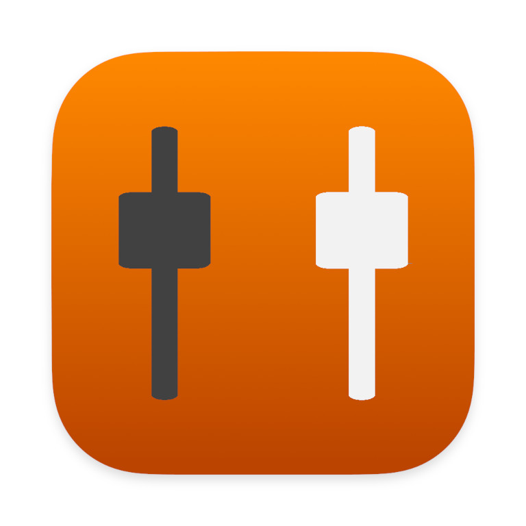

# Mackie of the Unicorn

Use control surfaces to control a MOTU AVB DSP mixer.

⚠️ **This project is in development and is not yet ready for production use. [Click here](https://ci.sjoerdscheffer.nl/job/Mackie%20of%20the%20Unicorn/job/master/) to get the latest development build and documentation.**

## Introduction
This project allows control surfaces to control the mixer of a MOTU AVB interface. It uses the Mackie Control Universal protocol to communicate with the control surface and uses HTTP to communicate with the MOTU mixer.

MOTU AVB interfaces allow control surfaces to connect via OSC, but this only allows for one-directional communication. This project aims to provide bi-directional communication between the control surface and the mixer by using MOTU's REST API.

This project is tested using a single ICON QCON Pro G2 control surface and a MOTU 8M audio interface because that's the hardware I own. I will add support for using two control surfaces once I have another one.

## Goals for v0.1
These are the goals for the next release (checked goals are already implemented):

- [x] Support a single Mackie Control unit
- [ ] Control channel faders
- [x] Control channel mutes
- [x] Control channel solos
- [ ] Control channel pan
- [x] Show channel names on the scribble strip
- [x] macOS support
- [x] Windows support
- [x] Graphical user interface
- [ ] Control stereo channels using a single channel strip
- [x] Bank between 8 channels
- [x] Documentation
